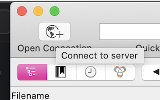
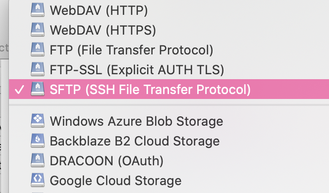
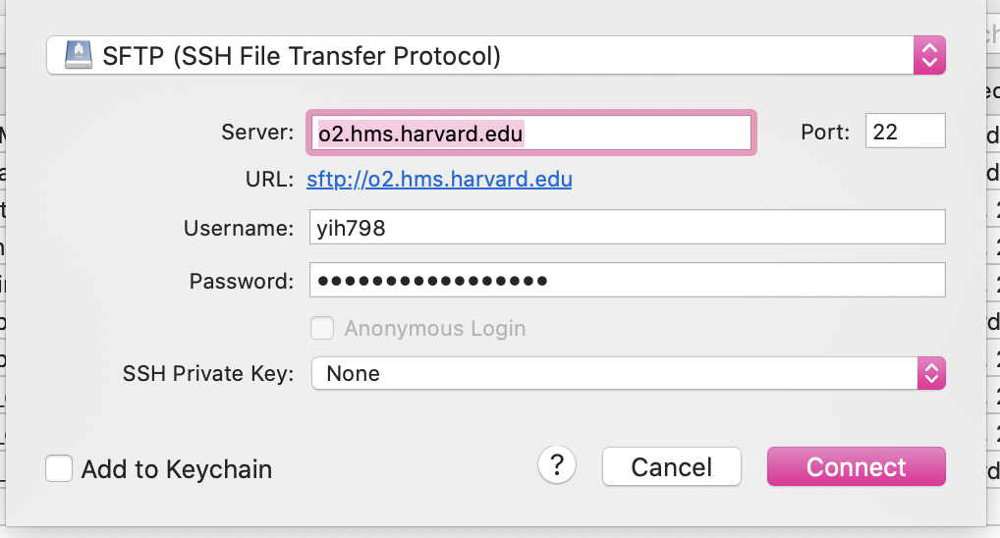

# Introduction to O2
This documentation is a collection of advice for novices to cloud computing. It aims at making it easier for people to get their hands on O2.

- For official documentation, visit the Wiki page https://wiki.rc.hms.harvard.edu/display/O2
- For a detailed introduction, visit https://rc.hms.harvard.edu/training/introO2/IntroToO2.pdf

## Login
To login onto O2 from your local server
```ssh usename@o2.hms.harvard.edu```
After entering your password, O2 should send back a prompt asking for duo authentification
```Duo two-factor login for yih798

Enter a passcode or select one of the following options:

 1. Duo Push to XXX-XXX-6681
 2. Phone call to XXX-XXX-6681
 3. SMS passcodes to XXX-XXX-6681

Passcode or option (1-3): 
```

## Running jobs in the interactive mode
After passing the duo authentification, you should see your home page.\
```[username@login03 ~]$ ```

Usually, we have three things to do:
### 1. cd to your group folder
cd to your folder in your group folder. The path is usually long. So I suggest setting up an alias\
```alias home="cd /your_group_folder_absolute_path/your_username/"```

Now enter ```home```, and you should be directed to your folder. But the alias gets cleaned when you log out. You could write the aliases in your .bash_profile or reset them every time you log in.

### 2. Switching to a computing node
Switch to a computing node so that you can run memory-intensive jobs in the interactive mode.
The following line asks for an interactive job for 30G memory and 12 hrs duration (O2 requires its user to run no more than two interactive nodes simultaneously, And the time limit for interactive nodes is 12 hrs). \
```srun --pty -p interactive --mem 30G -t 0-12:00 /bin/bash```

After running it you should see
 ```srun: job 14941530 queued and waiting for resources
    srun: job 14941530 has been allocated resources
```
This should change your node from "login#" to "compute-a-16-165 your_username".

To quit the computing node (e.g., when you want to request more memory or time), enter ```quit```.

### 3. Activating a conda environment 
On O2 if you want to install packages, you have to create a virtual environment (venv), and install packages under the venv.\
If you have never heard of a virtual environment, just interpret it as a place to store all your packages for a project. Most of the time you should create one venv for one project.

If it's the first time you use conda on o2, you have to load it and configure it first.\
To load conda, run ```module load conda```\
If it did not work, try specifying the conda version. E.g. ```module load conda2/4.2.13```

After loading it, configure it with ```conda init bash```. If you are using a shell other than bash, put your shell name instead of bash.\
There should be somewhere to configure bash so you don't need to call ```module load conda``` every time you log in, but I forgot how to do it.

To create a venv using conda:\
```conda create -n venv_name```

After hitting enter, you should see the following lines:
```Collecting package metadata (current_repodata.json): done
Solving environment: done


==> WARNING: A newer version of conda exists. <==
  current version: 4.7.5
  latest version: 4.8.3

Please update conda by running

    $ conda update -n base conda


## Package Plan ##

  environment location: /home/your_username/.conda/envs/test


Proceed ([y]/n)? 
```
Enter y for yes should finish up creating the venv.
```Preparing transaction: done
Verifying transaction: done
Executing transaction: done
#
# To activate this environment, use
#
#     $ conda activate venv_name
#
# To deactivate an active environment, use
#
#     $ conda deactivate
```
As it suggests, ```conda activate venv_name``` activates the venv, whereas ```conda deactivate``` deactivates it.

### Installing packages 
It would help if you used conda to install packages. Different packages have different ways to install. Look them up on Google.

### Calling python
Same as in your local shell: ```python test.py```

## Running jobs in a non-interactive mode
(For detailed, official documentation, visit: https://wiki.rc.hms.harvard.edu/display/O2/Using+Slurm+Basic).

Jobs running under the interactive mode pause when your laptop enters sleeping mode. Also, sleeping mode usually breaks the pipeline (halts the connection to the server). So when you have a long task to run, you should use the ```sbatch``` command to submit a job to the cloud.\
To do this, we have to write a bash script. A typical script looks like the following:
```#!/bin/bash
#SBATCH -c 4                               # Request four cores
#SBATCH -N 1                               # Request one node (if you request more than one core with -c, also using
                                           # -N 1 means all cores will be on the same node)
#SBATCH -t 0-12:00                         # Runtime in D-HH:MM format
#SBATCH -p short                           # Partition to run in
                                           # Time limit for 'short' tasks: 12 hours
                                           #                'medium': 5 days
                                           #                'long': 30 days
#SBATCH --mem=20G                          # Memory total in MB (if no unit appended after the number. For all cores). G means in G.
#SBATCH --mail-type=ALL                    # Type of email notification- BEGIN,END,FAIL,ALL
#SBATCH --mail-user=your_email_address.    # Email to which notifications will be sent

python test.py                             # Your command to run. E.g. when running a shell script, you should put sh test.sh                                                 
```

### something to note
1. All paths in the script must be absolute paths. If you did not use the absolute path, then for sure, you will not find your result. Also, they will probably get stored in someone else's directory.
2. Test your script on a small amount of data and a small memory request before getting on the actual giant data. Queuing for resources takes time.
3. When dealing with large amounts of data, request at least 20G to ensure your processes do not get killed near the end.
4. When running time-consuming tasks, keep a log, or track your task piecewise. So when your program halts at some point after running for two days, you do not need to rerun all.

## Using GUI (graphic user interface) to view your folders
I use CyberDuck: https://cyberduck.io/.
### Login on CyberDuck
1. Click on the Open Connection button. It will pop up a window asking for your username and password.\

2. Click on the first bar and choose the SSH Protocol\

3. Enter your information and hit connect. This should give you send you a push on DUO.\


You should now see your home/user_name folder. To go to the group folder, click on the directory bar and select / to go to the root folder. Follow your group folder path to go to your group folder.\


